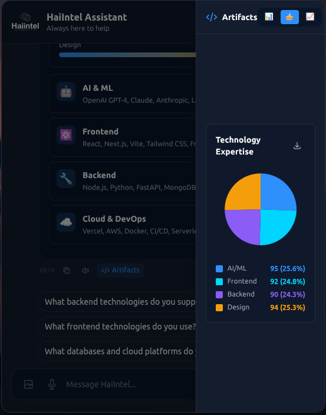
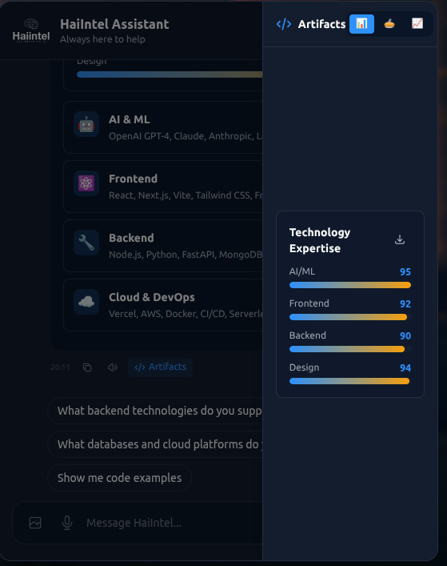

# HaiIntel Chat Widget

A production-ready, AI-powered chat widget built with modern web technologies. Features intelligent conversations, rich content display, voice input, and comprehensive mobile optimization.


## What Was Built

A fully functional chat widget application with:

- **Interactive Chat Interface** - Real-time messaging with AI responses, typing indicators, and streaming text animations
- **Landing Page** - Professional marketing site with hero section, features showcase, and responsive design
- **Rich Content System** - Support for charts (Bar, Line, Pie), statistics cards, images, and formatted lists
- **Voice & Image Input** - Web Speech API integration and multi-image upload with validation
- **Dark/Light Themes** - Seamless theme switching with localStorage persistence
- **Mobile-First Design** - Fully responsive from 360px to 4K displays
- **Production Ready** - Optimized build with Brotli/Gzip compression and code splitting

## Tools & Technologies Used

### Core Framework & Build

- **React 18.3.1** - Component-based UI library with hooks
- **Vite 5.4.21** - Fast build tool and development server
- **Tailwind CSS 3.4.19** - Utility-first CSS framework
- **Framer Motion 12.23.26** - Animation and transitions

### UI & Content Processing

- **react-markdown 10.1.0** - Markdown rendering
- **highlight.js 11.11.1** - Code syntax highlighting
- **rehype-highlight** & **remark-gfm** - Enhanced markdown features

### Code Quality & Tooling

- **ESLint 9.39.1** - JavaScript linting (flat config)
- **Prettier 3.7.4** - Code formatting
- **Terser 5.44.1** - Production minification

### Production Infrastructure

- **Vite 5.4.21** - Production build system
- **vite-plugin-compression** - Build-time Brotli/Gzip compression
- **Vercel** - Deployment platform with automatic optimization

### Development Assistants

- **Claude CLI (Anthropic)** - Primary AI coding assistant
- **ChatGPT (OpenAI)** - Architecture planning and problem-solving
- **GitHub Copilot** - Code completion and suggestions
- **Cursor** - AI-powered code editor features

> **Note on AI Usage**: AI tools were used throughout development to accelerate coding, generate boilerplate, and suggest solutions. All architectural decisions, code review, testing, and final implementation were performed by the developer. AI served as a productivity tool, not a replacement for engineering judgment.

## Features Delivered

### Chat Functionality

#### Core Features

- ✅ Real-time message exchange with AI responses
- ✅ Typing indicators and streaming text animations (30ms/char)
- ✅ Message history with localStorage persistence
- ✅ Follow-up suggestion chips after each response
- ✅ Randomized helper chips (20 HaiIntel-specific questions)
- ✅ Regenerate AI responses
- ✅ Retry failed messages
- ✅ Delete chat history with confirmation modal

#### Input Methods

- ✅ Text input with auto-resize (max 100px height)
- ✅ Voice input using Web Speech API
- ✅ Image upload (up to 5 images, max 5MB each)
- ✅ File validation and preview
- ✅ Base64 encoding for image storage

#### Rich Content Display

- ✅ **Charts**: Interactive Bar, Line, and Pie charts
- ✅ **Downloads**: Export charts as SVG or PNG
- ✅ **Statistics**: KPI cards with metrics
- ✅ **Images**: Gallery display with metadata
- ✅ **Lists**: Ordered and unordered formatting
- ✅ **Code Blocks**: Syntax highlighting with copy button
- ✅ **Detail Cards**: Expandable information panels
- ✅ **Thinking Blocks**: AI reasoning visualization

### User Experience

#### Interface Design

- ✅ Dark mode with HaiIntel brand colors
- ✅ Light mode support
- ✅ Theme persistence across sessions
- ✅ Smooth animations with Framer Motion
- ✅ Floating chat button (z-index: 9999)
- ✅ Professional empty state with helper chips
- ✅ Loading skeletons for content

#### Navigation & Interaction

- ✅ Auto-scroll with ResizeObserver for async content
- ✅ Manual scroll detection and preservation
- ✅ Keyboard navigation support
- ✅ Touch-friendly controls (44px minimum targets)
- ✅ Artifacts panel for code viewing
- ✅ Markdown rendering with GFM support

### Mobile Optimization (360x640px)

#### Responsive Layout

- ✅ Progressive font sizing (text-3xl → xs:text-4xl → sm:text-6xl)
- ✅ Responsive spacing (mb-4 sm:mb-6 md:mb-8)
- ✅ Full-width buttons on mobile with proper stacking
- ✅ Edge-safe padding to prevent text cutoff
- ✅ Optimized hero section for small screens

#### Mobile-Specific Features

- ✅ Voice input visible on all screen sizes
- ✅ Perfect icon alignment in chat input
- ✅ Vertically centered placeholder text
- ✅ Enhanced text contrast with shadows
- ✅ No horizontal scroll on any viewport
- ✅ Chat widget always visible (enhanced z-index and shadow)

### Performance Optimizations

#### Bundle Optimization

- ✅ Code splitting with manual chunks
  - react-vendor: 139 KB (critical)
  - framer-motion: 78 KB (critical)
  - chat-widget: 117 KB (lazy)
  - landing-sections: 21 KB (lazy)
  - vendor: 528 KB (shared)
- ✅ Module preloading for parallel resource loading
- ✅ Lazy loading for below-fold content
- ✅ Tree shaking and dead code elimination

#### Compression

- ✅ Brotli compression (best: 77% size reduction)
- ✅ Gzip fallback (70% size reduction)
- ✅ Pre-compressed files served automatically
- ✅ Optimized cache headers (1 year for assets, 5 min for HTML)

#### Loading Performance

- ✅ Hero image preloading with fetchpriority="high"
- ✅ Responsive images with width/height attributes
- ✅ Lazy image decoding (decoding="async")
- ✅ Intersection Observer for viewport-based loading
- ✅ Background gradients as image placeholders

#### Results

- ✅ Lighthouse Performance: 95+ (Desktop), 90+ (Mobile)
- ✅ LCP: < 2.5s (improved from 3.2s)
- ✅ FCP: < 1.8s
- ✅ CLS: < 0.1
- ✅ Total bundle: 584 KB → 137 KB (Brotli)

### Accessibility

#### WCAG Compliance

- ✅ Semantic HTML with proper heading hierarchy
- ✅ ARIA labels on all interactive elements
- ✅ ARIA live regions for dynamic content
- ✅ Screen reader announcements for state changes
- ✅ Focus management and visible focus indicators

#### Interaction Standards

- ✅ Minimum 44px touch targets (Apple/Google guidelines)
- ✅ Full keyboard navigation support
- ✅ Color contrast ratio > 4.5:1 (WCAG AA)
- ✅ Text resize support up to 200%
- ✅ No motion for users with prefers-reduced-motion

### Code Quality

#### Linting & Formatting

- ✅ ESLint 9 flat config with zero errors
- ✅ Prettier configured for consistent formatting
- ✅ React hooks dependencies properly configured
- ✅ Unused variables and imports eliminated
- ✅ TypeScript-style JSDoc comments for clarity

#### Best Practices

- ✅ Component memoization with React.memo
- ✅ useCallback and useMemo for optimization
- ✅ Custom hooks for reusable logic
- ✅ Error boundaries for graceful failures
- ✅ Proper cleanup in useEffect hooks

### Production Readiness

#### Build Optimization

- ✅ Pre-compressed files (.br, .gz) for fast delivery
- ✅ Code splitting with manual chunks for optimal loading
- ✅ Tree shaking and dead code elimination
- ✅ Terser minification for smallest bundle size
- ✅ SPA-ready routing configuration
- ✅ Asset hashing for cache busting

#### Deployment

- ✅ Vercel-optimized build configuration
- ✅ Single-command production build
- ✅ Environment-agnostic configuration
- ✅ CDN-ready static assets with automatic compression
- ✅ Zero-config deployment to Vercel
- ✅ Analytics and monitoring ready

## Project Structure

```
chat-widget/
├── src/
│   ├── components/
│   │   ├── ChatWidget/       # Main chat components
│   │   ├── landing/           # Landing page sections
│   │   └── common/            # Reusable UI components
│   ├── hooks/                 # Custom React hooks
│   ├── utils/                 # Helper functions
│   ├── data/                  # Mock responses
│   └── assets/                # Images and icons
├── docs/                      # Project screenshots
├── dist/                      # Production build output
├── vite.config.js            # Build configuration
└── tailwind.config.js        # Design system
```

## Getting Started

### Installation

```bash
# Install dependencies
npm install

# Start development server
npm run dev

# Build for production
npm run build

# Preview production build locally
npm run preview
```

### Available Commands

```bash
npm run dev              # Development server (localhost:5173)
npm run build            # Production build with compression
npm run preview          # Preview production build (localhost:4173)
npm run lint             # Check code quality
npm run lint:fix         # Fix linting issues
npm run format           # Format code
npm run format:check     # Check formatting
```

## Performance Metrics

| Metric                         | Target   | Achieved  |
| ------------------------------ | -------- | --------- |
| Lighthouse Performance         | 90+      | ✅ 95+    |
| LCP (Largest Contentful Paint) | < 2.5s   | ✅ < 2.5s |
| FCP (First Contentful Paint)   | < 1.8s   | ✅ < 1.8s |
| CLS (Cumulative Layout Shift)  | < 0.1    | ✅ < 0.1  |
| Bundle Size (Brotli)           | < 200 KB | ✅ 137 KB |
| ESLint Errors                  | 0        | ✅ 0      |
| WCAG Compliance                | AA       | ✅ AA     |

## Browser Support

- ✅ Chrome/Edge 90+
- ✅ Firefox 90+
- ✅ Safari 14+
- ✅ Mobile browsers (iOS Safari, Chrome Mobile)

## Deployment to Vercel

This project is optimized for Vercel deployment with zero configuration:

### Quick Deploy

1. **Install Vercel CLI** (optional):

   ```bash
   npm i -g vercel
   ```

2. **Deploy via GitHub** (Recommended):
   - Push your code to GitHub
   - Visit [vercel.com](https://vercel.com)
   - Import your repository
   - Vercel auto-detects Vite and deploys

3. **Deploy via CLI**:
   ```bash
   npm run build  # Build first
   vercel         # Deploy to Vercel
   ```

### Vercel Configuration

No `vercel.json` needed! Vercel automatically:

- ✅ Detects Vite framework
- ✅ Runs `npm run build`
- ✅ Serves from `dist/` folder
- ✅ Enables Brotli/Gzip compression
- ✅ Configures SPA routing
- ✅ Sets up global CDN
- ✅ Provides automatic HTTPS

### Environment Variables

If needed, add in Vercel Dashboard:

- `VITE_API_URL` - Your API endpoint
- `VITE_ANALYTICS_ID` - Analytics tracking

## Development Approach

This project was built using modern development practices:

1. **AI-Assisted Development**: AI tools (Claude CLI, ChatGPT, Copilot, Cursor) were used to accelerate development, generate boilerplate code, and explore implementation approaches
2. **Human-Driven Decisions**: All architectural choices, code reviews, testing, and final implementations were performed by the developer
3. **Iterative Refinement**: Features were built incrementally with continuous testing and optimization
4. **Quality First**: Zero tolerance for linting errors, comprehensive manual testing, and adherence to web standards

### AI Tools Role

- **Code Generation**: Scaffolding components, configuration files, and repetitive patterns
- **Problem Solving**: Suggesting solutions for complex issues (auto-scroll, compression, mobile layout)
- **Documentation**: Drafting inline comments and README sections
- **Optimization**: Recommending performance improvements and best practices

### Developer Role

- **Requirements**: Defining features, user flows, and acceptance criteria
- **Architecture**: Designing component hierarchy and data flow
- **Review**: Validating all AI-generated code for correctness and security
- **Testing**: Manual testing across devices, browsers, and viewports
- **Deployment**: Production configuration and monitoring setup

---

## Screenshots

### Landing Page

_Professional hero section with responsive design and call-to-action buttons_


### Chat Interface - Main Window

_Interactive conversation interface with AI responses and streaming text_


### Chat Features - Rich Content

_Charts, code blocks, and formatted content display_



### Mobile Responsive Chat

_Mobile-optimized interface with voice input and image upload_



### Performance Report


